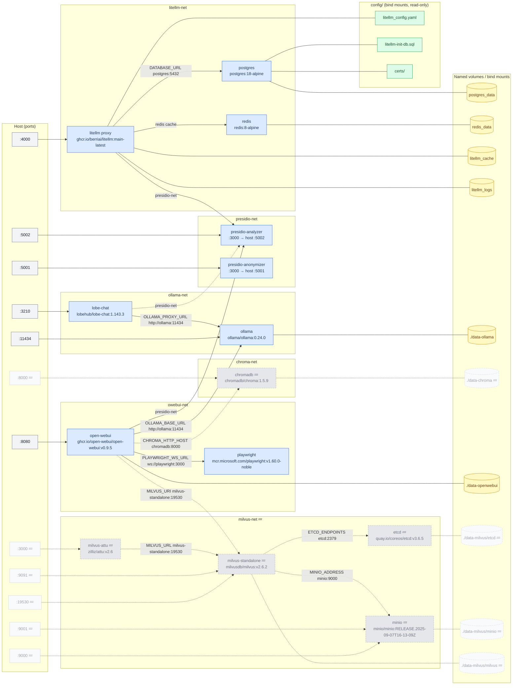

# PII models in Docker

PII / PHI / PCI detection and anonymization service plus its surrounding dev stack. Docker Compose for development; Kubernetes + Helm in production.

## Terms

* Personally Identifiable Information (PII)
* Protected Health Information (PHI)
* Payment Card Industry (PCI)

## Subprojects

### 1. `docker-compose.yml` — dev stack

A pure `include:` list assembling fragments under `compose/` into a 9-service dev environment: **ollama** (GGUF LLM server), **presidio-analyzer** / **presidio-anonymizer**, **postgres** + **litellm** proxy + **redis** (the LiteLLM proxy stack), **lobe-chat**, **open-webui** + **playwright** (web UIs + web scraper). Config files (`litellm_config.yaml`, init SQL, TLS certs) live under `config/`. Resource limits are sized for a 6 CPU / 16 GB host.

Bring it up from the repo root:

```bash
cp .env.template .env       # fill OPENAI_API_KEY, MISTRAL_API_KEY, LITELLM_* secrets
make                        # docker compose up -d
make ollama-pull-models     # pull the GGUF PII LLMs into the ollama container
```

See [`CLAUDE.md`](./CLAUDE.md) for the full compose layout, env vars, and operational notes.

#### Service interconnections



> **Legend:** 💤 = commented out in `docker-compose.yml` (dashed borders/lines). Pink node = one-shot init container (exits after completion). Uncomment the relevant fragment in `docker-compose.yml` to enable: `compose/chromadb.yml`, `compose/milvus.yml`.

### 2. `app/` — FastAPI PII service

A stateless FastAPI app whose endpoints route through a Pydantic AI agent over LiteLLM, dispatching to one of two backends: **GLiNER** (in-process token classification, baked into the image) or **Ollama** (out-of-process GGUF instruct LLMs, reached over the compose network). Both backends return the same `list[Entity]` shape; the deterministic anonymizer is plain Python applied after the agent returns.

The directory is self-contained — it owns its `Dockerfile`, `Makefile`, `requirements.txt`, and source. Build the image from `app/`:

```bash
cd app
make                # docker build -t pii:1.0 . (bakes all four GLiNER models)
```

See [`app/CLAUDE.md`](./app/CLAUDE.md) for the build context, and [`app/ppi/CLAUDE.md`](./app/ppi/CLAUDE.md) for the package internals (call path, backend dispatch, editing rules).

## Architecture


### Other architecture ideas

* Architecture 1


* Architecture 2


